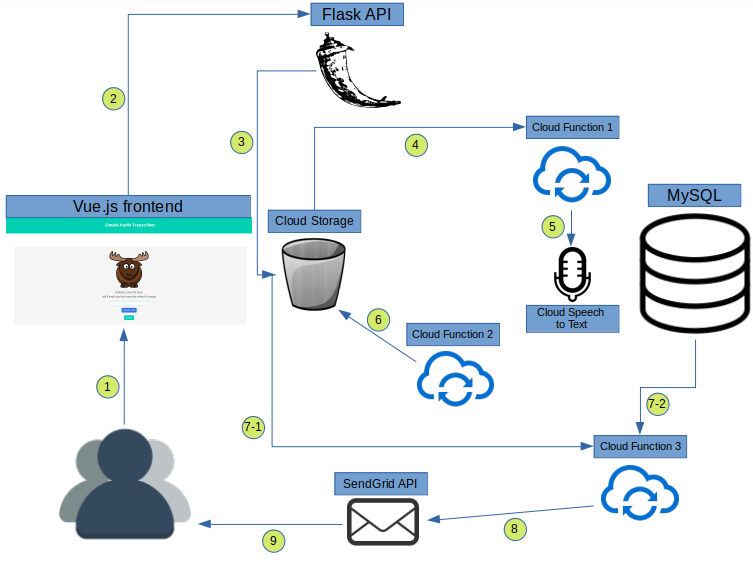

# Audio-Transcriber-SPA

Link: [https://fierce-wildwood-49103.herokuapp.com/audio-transcriber](https://fierce-wildwood-49103.herokuapp.com/audio-transcriber)

---

## Getting Started

This application was designed to provide a quick and easy way to convert audio to text. Users are automatically emailed their transcripts once the conversion process completes (email may be sent to *Spam* folder). 

Currently, the application only supports *.wav* files not exceeding *100MB*.

If you like this application and would like to keep it running, please support me on [*Patreon*](https://www.patreon.com/TheBackyardMoose).

## Tools and Workflow

1. User enters email and uploads audio file to *Vue.js* frontend.
2. Once the user clicks submit, a POST request is sent to the *Flask API* backend.
3. The Flask backend uploads user's audio file to Google Cloud Storage.
4. Once audio file upload is complete, Google Cloud Storage trigger fires off cloud function 1.
5. Cloud function 1 starts the conversion process using Google Speech-to-Text API. This ID of the operation created is stored in the database.
6. Cloud function 2 sends a GET request to the Speech-to-Text API periodically, for all pending operations. Once an operation is deemed complete, the text in the HTTP response is saved into a file and uploaded to Google Cloud Storage.
7. Cloud function 3:
   1. Once text file upload is complete, Google Cloud Storage trigger fires off cloud function 3.
   2. Cloud function also queries the database to extract user's email address.
8. An email directed at the user's email address along with a signedUrl link to the transcript text file is created. This email is passed along to the SendGrid API.
9.  The SendGrid API sends the email to the user.z
